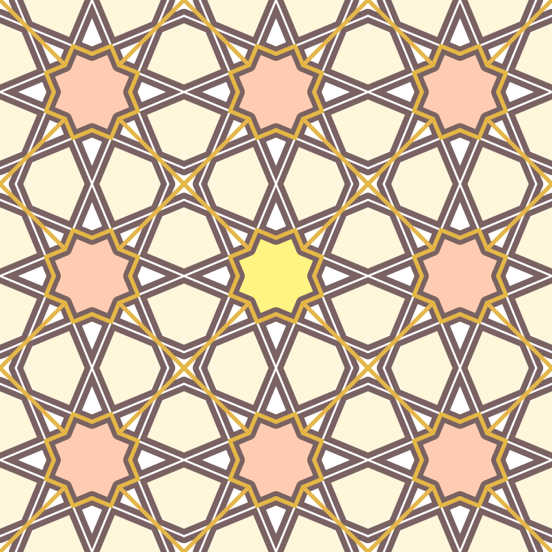
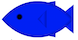
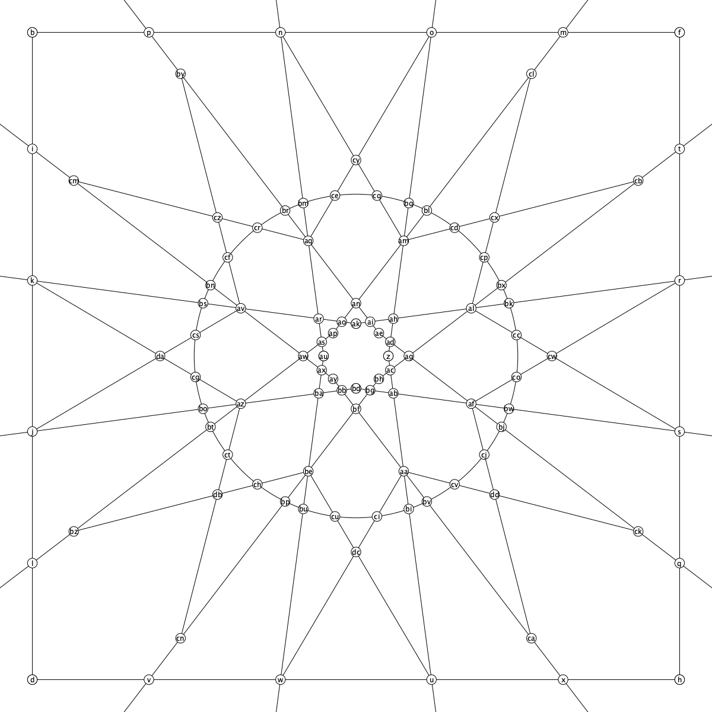
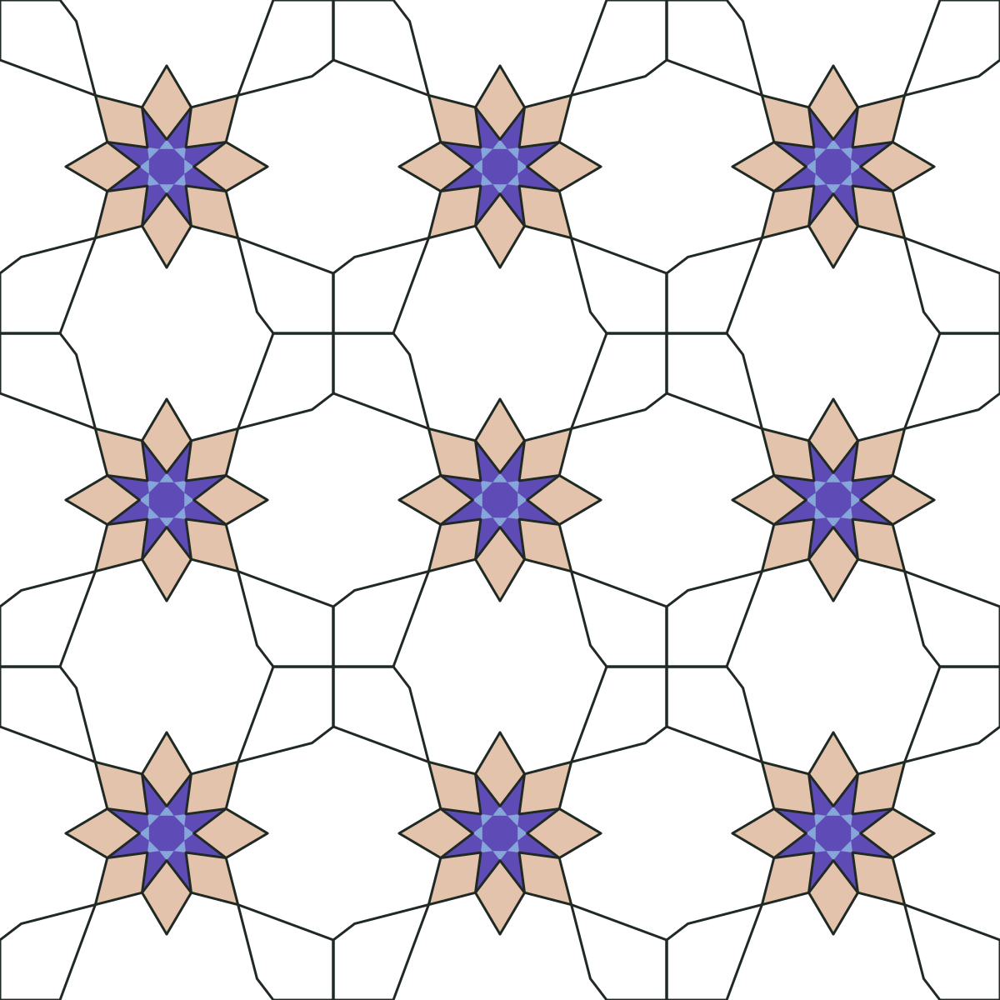

# Tessellation: A library for aiding in the creation of tessellated geometric patterns



Standard fish entry . Code can be found in example1.rkt.

Tessellation is a library on top of the Racket Metapict library for creating geometric patterns.  You can watch [this](https://www.youtube.com/watch?v=pg1NpMmPv48) to get an idea of how this library works. 


## How the Library Works

The way to define patterns with this library has two parts, first you create the underlying grid, then you specify the design you want, using said grid. Let's walk through a simple example. First we'll define the underlying grid via the following code:

```racket
(define g
  (generate-grid 
                 ;; square-frame is predefined to mean the box indicating where the tessellation will occur.
                 square-frame
				 
                 (rotate/8 (vmirror (curve (med -1 (pt 0.3 -1) (pt 0.1 1)) .. (pt 0.1 0))))
				 (circle 0.5)
                 (rotate/8 (curve al .. s))
                 (rotate/8 (curve af .. r))))
```

This results in a grid looking like the following:



A few notes about how this works:

- `(curve pt1 .. pt2)` is how we can define lines on this grid. 
- Notice how there are lines extending out of the box. The `med` function is used to extrapolate the line.
- The functions `vmirror`, `hmirror` take a list of curves and produces a list of all the curves plus their vertical/horizontal reflection across the origin.
- The functions `rotate/4`, `rotate/8`, and `rotate/16`, take a list of curves and produces a list of 4/8/16 curves each at a 90deg/45deg/22.5deg offset.
- All of the intersection poits for all lines are calculated automatically and "bound" to variable names. Notice on the bottom two curves, we refer to their generated names 'al', 's', 'af', and 'r'.

Generating this grid is usually an itterative process: you draw some lines, look at the new grid, and draw some more lines based off of the new intersection points.

Next we generate the pattern itself based on the grid. Here is follow-up code:

```racket
(with-window (window -1 5 -1 5)
  (let ((blue (make-color* #x86 #xa5 #xd9))
        (purple (make-color* #x5f #x4b #xb6))
        (sand (make-color* #xe4 #xc3 #xad))n
        (cobalt (make-color* #x86 #xa5 #xd9))
        (green (make-color* #x20 #x2a #x25))
        (small-petal (with-grid g (curve bb -- bg -- bf -- cycle))))
    (draw
     (color purple (tessellate g 3 3
                               (fill (circle (dist av (pt 0 0))))))
     (color blue (tessellate g 3 3
                             (fill (rotate/8 small-petal))))
     (color sand (tessellate g 3 3
                                  (fill (rotate/8 (curve bf -- aa -- dc -- be -- cycle)))))
     (color green (penwidth 3 (tessellate g 3 3
                                   (rotate/8 (curve db -- az -- ba -- be -- cycle))
                                   (rotate/4 (curve db -- v -- d -- l -- bz -- cycle))))))))
```

Here are some more points to take note of:

- We can wrap our `with-window`to specify the display window. Remember each tessellation's size is 2x2.
- We can define colors to use later. A lot of the Metapict functionality works here.
- Notice how we also saved a shape ahead of time. The `with-grid` macro "binds" all of the intersections to variable names so you can define a curve in terms of the intersection names.
- We then set-up the color, penwidth, etc. befor calling tessellate.
- The `tessellate` macro takes a grid and a horizontal and vertical tessellation count, followed by a list of curves. We can fill the curves by adding `fill` (fill must be the outermost function).
- Just like before, we can refer to intersections by the name given outomatically. 

The final result is as follows:




## Installation

To use this package you can install it from the racket packet server at https://pkgs.racket-lang.org/package/tessellation . This packet depends on the metapict library (https://github.com/soegaard/metapict) and should work with the latest version.
